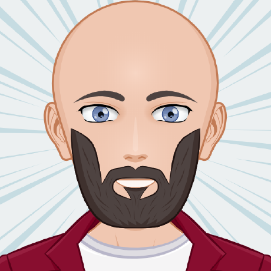

# CV

## 1. Name
* Anatolian Anushavan
## 2. Contacts
* Discord: Comeback_khv#3420
## 3. About me
* Main goal is to secure employment with a reputable company, where i can utilize my knowledge and skills to the maximum. 
* Strengths are discipline, communication skills, purposefulness.
## 4. Skills
* Programming languages:
  * HTML 
  * CSS
* Version Control System:
  * Git
* Development tool:
  * VSCode

## 5. Code example
    function multiply(a, b){
      a * b
    }
    
## 6. Work experience
* Educational project - https://github.com/comeback-khv/rsschool-cv/tree/gh-pages
## 7. Education
* 2016-2020
* Far Eastern State Transport University 
* Bachelor Degree
## 8. English
* A2